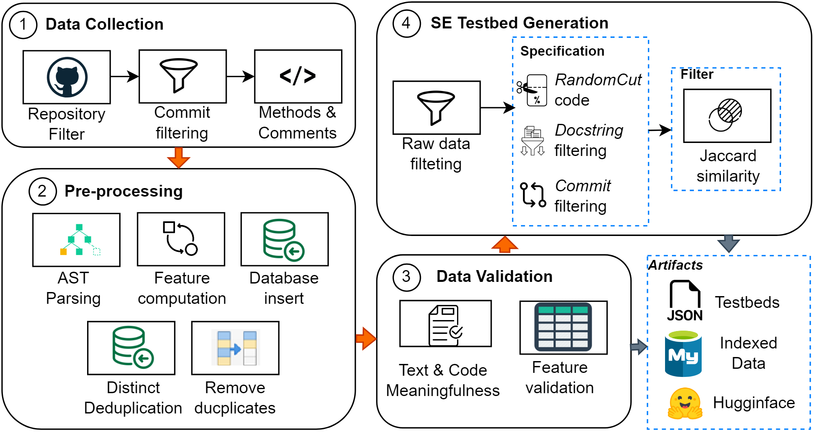
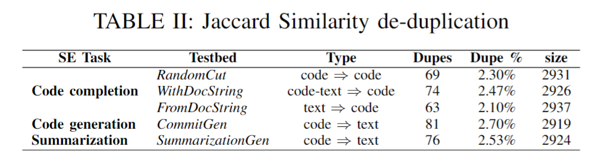
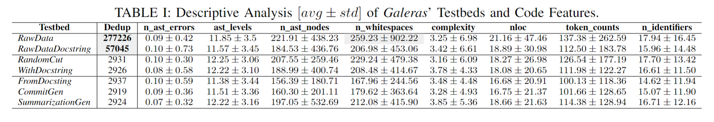
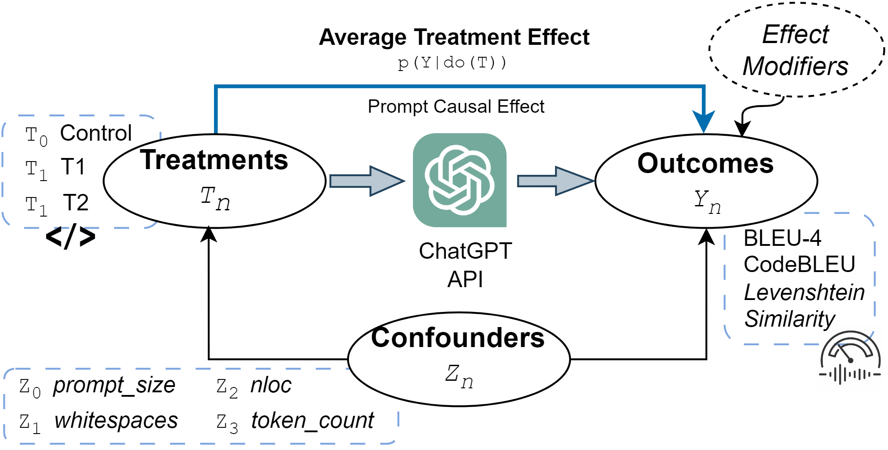
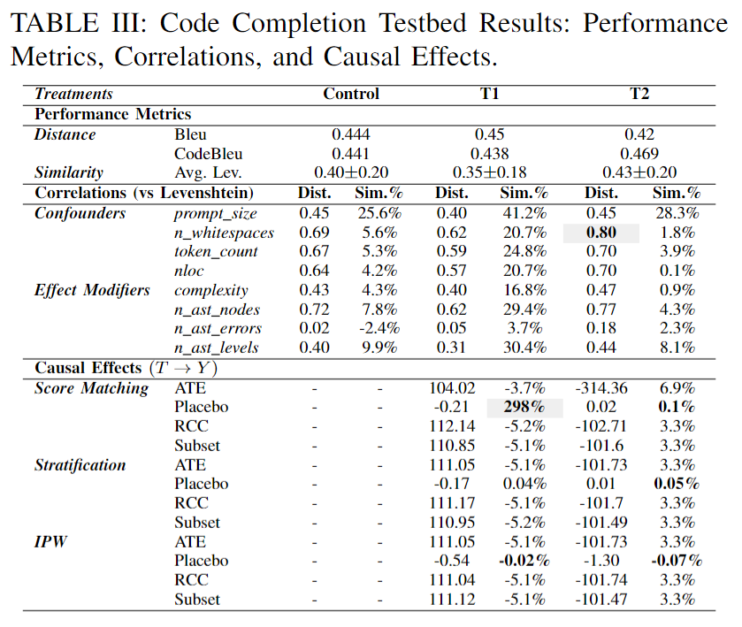

# Benchmarking Causal Analysis for Interpreting LLMs for Source Code

This project strives to create a benchmark to create causal analysis for LLM SE tasks. It does this by ustilizing the Galeras raw dataset for various different SE tasks and analyizing the results. This highlights the use cases of Galeras and its analysis approach.

## Use Cases

The primary focus is on answering causal queries of interest related to LLMs. It enables ML researchers in software engineering to explain the causal effect of a set of confounders associated with the treatment input prompt. Some of the use cases include:

### Code Auto-Completion:
Galeras can be used to evaluate LLM's performance in auto-completing code. Its provided non-contaminated code snippets can be used with our random cut implementation to randomly cut the code snippet somewhere after the code signature.

### Code Summarization:
Additionally, this facilitates the examination of an LLM's capacity for code summarization. Researchers can investigate the influence of various confounders on the production of code summaries by leveraging the dataset and benchmark provided.

### Code Generation
ML researchers have the opportunity to evaluate LLM's proficiency in producing test cases using Galeras. The benchmark provides a dedicated dataset tailored for test generation purposes, enabling a comprehensive assessment and interpretation of code generation performance.

### Bug Fixing:
We can utilize this to analyze LLM's effectiveness in bug fixing. Researchers can evaluate the causal relationship between different confounders and the accuracy of bug fixes generated by LLMs.

### Testbed Generation and Curation:

The collection pipeline for this dataset is as follows:

In the first step, popular github repos are filtered using the following query: 
*language : Python, fork : false, size :>= 30, 000,
pushed :> 2021 - 12 - 31, stars :> 1, 000*

Given ChatGPT's and the other LLMc under analysis have a training data cutoff date of ~September 2021, we selected data from January 2, 2022 to January 1, 2023. Therefore, we make the claim that our testbeds help to avoid *data snooping*. 

We then extracted code and documentation related features from each data point. After, using the [Tree-Sitter](https://tree-sitter.github.io/tree-sitter/) library, we parsed AST variables from each data point. These resultant features were de-duplicated, which reduced the test bed size to ~227k data points. There were ~77k data points that had a valid *docstring* that is: a docstring that is longer than 3 words. This docstring does not include inline comments.

We then selected 960 data points to manually validate out of the ~227k data points from *RawData* and *RawDataDocstring*. The remaining data points were verified automatically.

Our steps for verification are as follows:
- Verify that the push date of each commit is within the acceptable range (January 2, 2022 to January 1 2023)
- Confirm that the method associated with any given commit was actually changed in the changelog
- Validate *n_words*
- Validate confounders
- Validate AST levels and AST errors using [Tree-Sitter Playground](https://tree-sitter.github.io/tree-sitter/playground)
- Validate cyclomatic compleixty using pycharm
- Verify whitespace count
- Verify if random split is after function signature
- Verify docstring is not empty
- Remove all one line functions and pass statements
- Select functions with more than one return statement
- Confirm that summary is meaningful
- Confirm that summary/docstring accurately represents code snippet functionality

After this verification step, we then sampled 3k data points from *RawData* in order to build five additional testbeds, each for a specific SE task. They are:
- *RandomCut*
- *WithDocString*
- *FromDocString*

for analysis on code completion tasks. As well as:
- *CommitGen*
- *SummarizationGen*

for analysis on code summarization tasks. 

In order to create *RandomCut* data points were selected that contain more than 10 tokens or 100 characters, and then those data points were randomly cut after the method signature.

*SummarizationGen* and *CommitGen* are data points drawn from *RawDataDocstring* that contain more than 10 words or 50 characters. 

The resultant five datasets were deduplicated based on the Jaccard similarity of data points computed using the BPE HuggingFace tokenizer. This figure lists the SE task that each dataset is suited for, along with the number and percentage of duplicate data points, and resultant size after deduplication.

This table shows summary statistics about the aformentioned data subsets.

## Analysis Approach

Galeras employs a causal analysis methodology to interpret the code generation process of LLMs. It utilizes a combination of control and two prompt treatments to configure the input for the model. The analysis primarily focuses on identifying the causal impact of confounders, which encompass the input code and text description, on both the treatment input prompt and the resulting generated code output.

The goal of Galeras is to provide a benchmark to compare the performance of LLM code (LLMc) against each other by controlling for features of the source code that can influence the prediction perforamnce of LLMc, or *confounding variables*. Galeras can be used to contextualize the outcomes of LLMc by providing tailorable treatment variables. 

The end goal of Galeras is for the research community to be able to understand typical perforamnce metrics by stating the assumptions of the predicition problem in a *Structured Causal Model* (SCM). In our case, the SCM is comprised of four random variables. *T* - treatments, *Y* - potential outcomes, *Z* - confounders, and *effect modifiers*.

*T* is the input configuration prompts in our case study. *Y* is the model predicition perforamnce, which can be measured in several different ways. (*e.g.* BLUE, CodeBLUE, Levenshtein). *Z* is variables affecting both *T* and *Y*. Finally, *effect modifiers* are features directly affecting the outcome *Y*. 

The benchmark provides a curated dataset with uncontaminated code snippets, accompanied by various confounding features for each data point. By examining the causal relationship between these confounding factors and the model's output, researchers can gain valuable insights into the factors that influence code generation in LLMs.

## Evaluation

### Methodology
The evaluation methodology of our case study is divided into three parts. The first part focuses on the exploritory analysis of the Galeras testbeds. We employed the BPE Tokenizer to normlize the vocabulary of each treatment T and outcome Y. 

Tokens from each category were classified in one of ten ways:
- Blocks
- Exceptions
- OOP
- Tests
- Declaration
- Conditional
- Loops
- Operators
- Casting
- Extra Tokens

Since our analysis was only focused on Python, keywords relating to data types (i.e. int, str) were classified as *casting* tokens. 

The second part of our analysis canonically evalutes ChatGPT using our testbed *WithDocString*. CodeBLEU was computed with a default parameter of 0.25, and BLUE was computed with a 4-gram parameter. For local evaluation, we computed the Levenshtein distance and similarity. 

The third part estimates the causal effect of prompt engineering methods and ChatGPT performance. We use Galeras to compare the performance of two different treatments. The first treatment $T_1$ is a single prompt that contains a command (*e.g. Complete the following Python code, return only code and complete method: '{partial code}'*) followed by the actual code to be completed. The second treatment $T_2$ comprises two prompts. The first one is a context prompt that entails both the *docstring* and the partial code. The second one is a *processing* prompt that contains sentences asking for removing comments and omptimizing code. We used the previous treatments against a *control* group. The control is a *task* prompt that encompasses an actino word or verb followed by the partial code. 

In order to evaluate whether treatments $T$ are effecting ChatGPT output $Y$, we controlled for confounding features $Z$. We assumed that our cofounders are:
- prompt_size
- n_whitespaces
- token_count
- nloc

The potential outcomes $Y_2, Y_1, Y_0$ are observed using treatments $T_1, T_2, control$. Next, using the SCM defined above, we approimate the *Average Treatment Effect* $p(Y| do(T))$. 

The benchmark underscores the significance of using clean datasets and prioritizes the provision of uncontaminated data for evaluation purposes. ML researchers have the capability to leverage this in generating fresh datasets tailored to specific software engineering tasks. This enables them to evaluate the performance of LLM on pertinent and carefully curated data.

### Results
We observed no significant difference in the counting of tokens among potential outcomes. For instance, *control* and $T_2$ on declarations with a difference of ~550 tokens and loops with a difference of ~600 tokens are relatively small. However, $T_1$ outcome exhibited high difference and excessive use of OOP, declarations and loops with a difference around 2.6k, 2k and 5k tokens respectively. We detected that the two prompt engineering methods were generating a similar amount of tokens (i.e., green and red distributions) compared to the control and ground truth. This suggests that sophisticated prompts tend to generate repetitive tokens. With respect to the Levenshtein similarity distance between the ChatGPT outputs, generated with both prompt engineering methods and the control, and the ground truth. We can observe from the proportion curve that T1 similarity performs the worst compared to the control and T2.

The purpose of our initial exploritory analysis was to expose and understand the testbeds feature distribution grouped by prompt engineering methods. There was high variability in n_whitespaces and token_count which implies the method sizes are not homogenous across the testbed. 

While the descriptive analysis shows high variability across all features, our testbeds are a representative sample of open repositories. For example,  the average value of code complexity is 3.25 suggesting a reasonable amount of loops, conditionals and operators in our testbed. 

As for the causal analysis, we found that ChatGPT performance is primarily influence by: number of white spaces, lines of code, tokens in the outcome and tokens in the prompt with a maximum correlation of 0.80 with respect to the Levenshtein distance.  This suggests that after controlling for con-
founders, the *Average Treatment Effect* (ATE) the prompt engineering $method_1$, represented by $T_1$, has a negative causal effect $p1(Y |do(T )) = E[Y1 − Y0] ≈ −5.1$% compared to a positive causal effect $p2(Y |do(T )) = E[Y2 − Y0] ≈ 3.3$% of $method_2$, represented by $T_2$. 

This indicated that $method_1$ is decreasing performance across the *WithDocString* testbed, while $method_2$ is actually enhancing ChatGPT predictive performace. This is consistent with our results that $T_2$ outperforms $T_1$. After controlling for the confounding effect of the code features such as the prompt size and token counts, we can claim that the reason why $T_2$ is performing better than $T_1$ is purely due to the information contained in the prompt.

## Conclusion

 By focusing on causal queries and considering a wide range of confounding features, Galeras enables ML researchers in SE to evaluate and interpret the code generation capabilities of LLMs. The benchmark dataset and testbeds facilitate transparent and interpretable evaluations, addressing the limitations of relying solely on accuracy metrics.

[def]: https://github.com/WM-SEMERU/chat-gpt-failures/blob/update_readme/figures/approach/galeras-pipeline.pdf